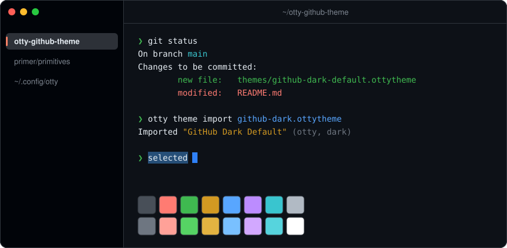
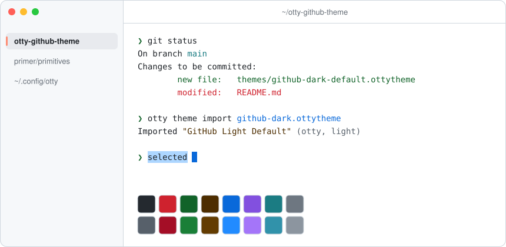
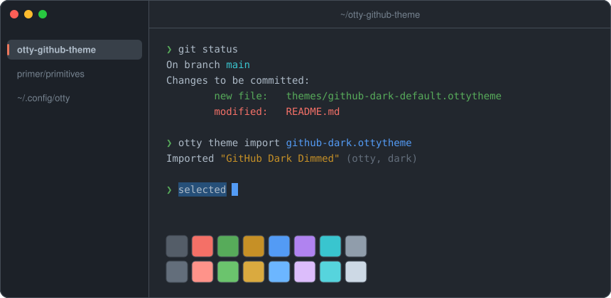
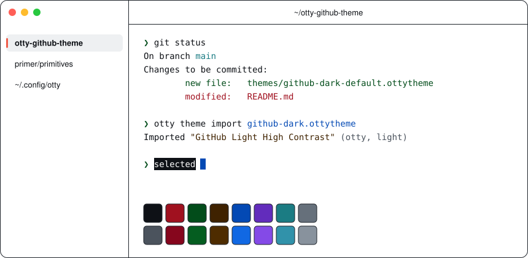
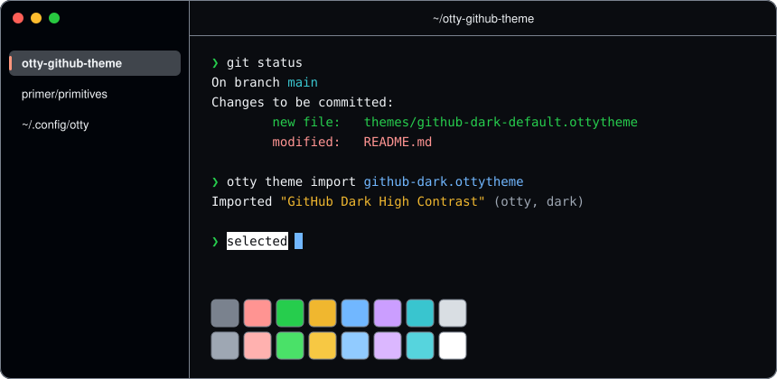
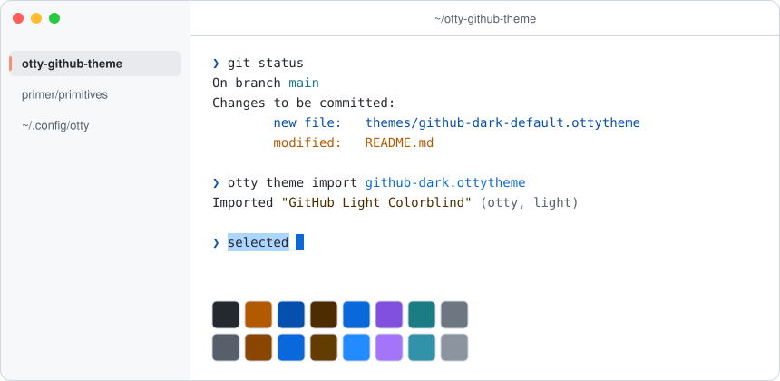
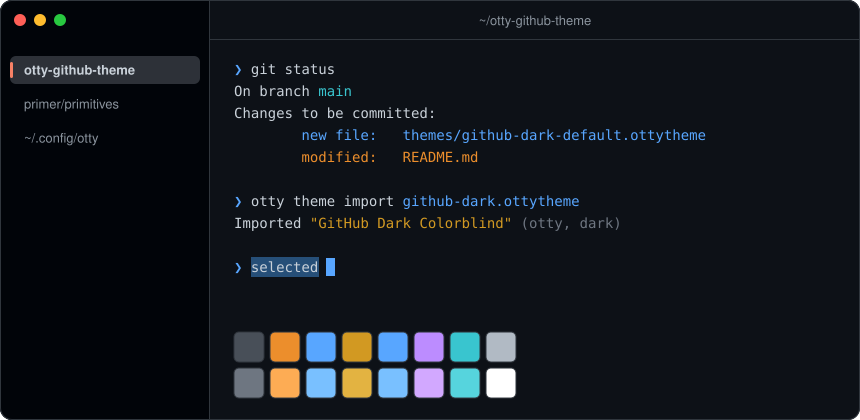
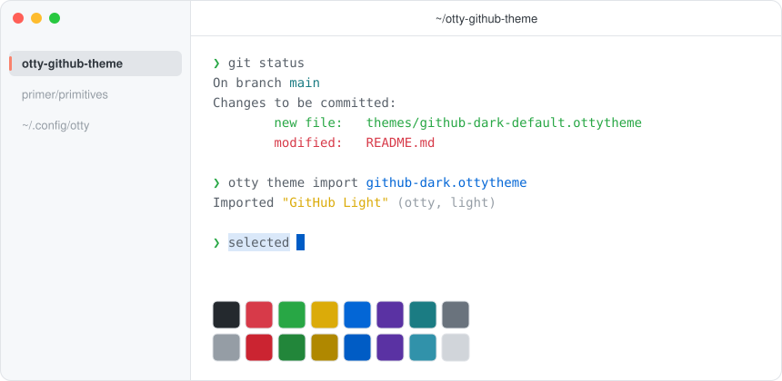
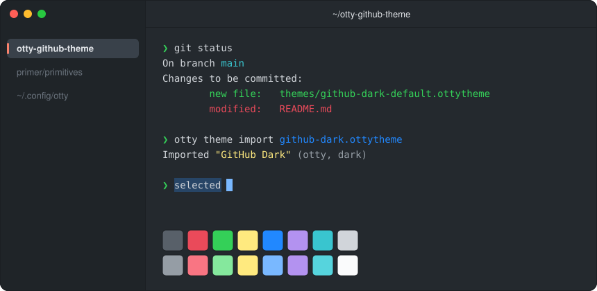

<div align="center">

# GitHub themes for Otty

All nine variants of GitHub's official [VS Code theme](https://github.com/primer/github-vscode-theme), ported to the [Otty](https://otty.sh) terminal.<br>
Full window styling, not just terminal colors: sidebar, tabs, title bar, selection and dividers.

[](https://github.com/kingsleydon/otty-github-theme/actions/workflows/ci.yml)
[](LICENSE)



</div>

## Install

**All nine themes:**

```sh
curl -fsSL https://raw.githubusercontent.com/kingsleydon/otty-github-theme/main/install.sh | sh
```

**One theme** (add `--activate` to switch to it right away):

```sh
otty theme import https://raw.githubusercontent.com/kingsleydon/otty-github-theme/main/themes/github-dark-default.ottytheme
```

**Manually:** download an `.ottytheme` file from [`themes/`](themes) and double-click it, or copy it into `~/.config/otty/themes/`.

Then pick a theme in **Settings → Appearance → Themes**, or set one per appearance in `~/.config/otty/config.toml`:

```toml
theme      = "GitHub Light Default"  # light mode
theme-dark = "GitHub Dark Default"   # dark mode
```

To update, run the install command again.

> [!TIP]
> If a theme seems to have no effect, look for top-level `foreground`, `background` or `palette-N` lines in `config.toml`. They override every theme.

## Themes

<table>
<tr>
<td align="center"><br><b>GitHub Dark Default</b></td>
<td align="center"><br><b>GitHub Light Default</b></td>
</tr>
<tr>
<td align="center"><br><b>GitHub Dark Dimmed</b></td>
<td align="center"><br><b>GitHub Light High Contrast</b></td>
</tr>
<tr>
<td align="center"><br><b>GitHub Dark High Contrast</b></td>
<td align="center"><br><b>GitHub Light Colorblind</b></td>
</tr>
<tr>
<td align="center"><br><b>GitHub Dark Colorblind</b></td>
<td align="center"><br><b>GitHub Light</b> (classic)</td>
</tr>
<tr>
<td align="center"><br><b>GitHub Dark</b> (classic)</td>
<td></td>
</tr>
</table>

Previews are drawn from each theme file's own colors by [`scripts/preview.py`](scripts/preview.py).

## How the colors map

Every color is copied from the VS Code theme. Each line in a theme file notes the VS Code key it came from.

| Otty | VS Code |
|---|---|
| Terminal text, background, 16 ANSI colors | `terminal.*`, `editor.background` |
| Cursor | `terminalCursor.foreground`, falling back to `editorCursor.foreground` |
| Selection | `editor.selectionBackground` / `editor.selectionForeground`, or VS Code's default when unset |
| Title bar | `titleBar.*` |
| Session sidebar | Explorer list (`sideBar.*`, `list.*`), with the Activity Bar's active indicator |
| Top tab strip | Editor tabs (`editorGroupHeader.*`, `tab.*`) |

The themes don't set a font, so your own font choice applies.

## Development

```sh
sh scripts/update.sh          # download the latest VS Code theme and regenerate themes/
python3 scripts/preview.py    # redraw assets/previews/
```

A [weekly workflow](.github/workflows/update.yml) does the same and opens a pull request when GitHub ships new colors.

## License

[MIT](LICENSE). Colors from [primer/github-vscode-theme](https://github.com/primer/github-vscode-theme) (MIT, © Primer).

Not affiliated with or endorsed by GitHub or Otty.
